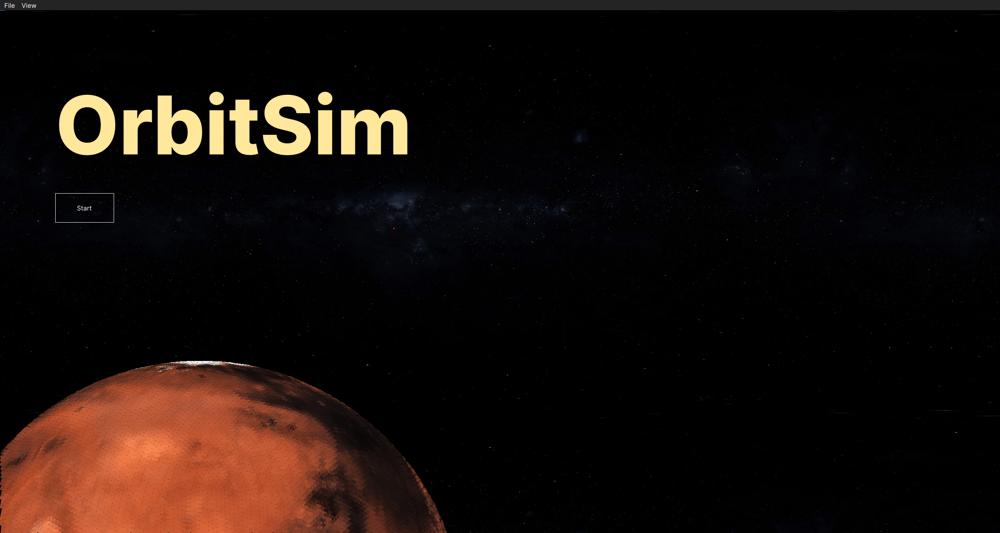

<h1 align="center">OrbitSim</h1>

<p align="center">
  Simulates orbits of objects about a central body. 
</p>



## Table of Contents

- [About](#about)
- [Prerequisites](#prerequisites)
- [Getting Started](#getting-started)
- [Project Structure](#project-structure)
- [Contributing](#contributing)
- [License](#license)

## About

This project was created to simulate orbits of objects about a central body. The project is written in C++ and uses the Python for graphics. The project is currently in development.

## Prerequisites

- Python 3.11 or higher
- C++ 17 or higher
- CMake 3.15 or higher

## Getting Started

Follow these steps to get the project up and running on your local machine.

1. Clone the repository and enter the directory
   ```shell
   git clone https://github.com/daniel360kim/OrbitSim.git
   cd OrbitSim/Simulator
   ```
2. Create a build directory and enter it
   ```shell
    mkdir build
    cd build
    ```

3. Run CMake
    ```shell
    cmake ..
    ```

4. Build the project
    ```shell
    cmake --build .
    ```

This command will invoke the build system to compile the source files and generate the executable.

5. Once the build process completes successfully, you can find the executable in the build directory.
An example of the moon is already loaded. You can run the executable or run the project. 

6. A csv file will be generated in the build directory. This file contains the position and velocity of the object at each time step. You can use this file to plot the orbit of the object using the Python visualization.

7. Within visualization.py, specify the path to the csv file. Then run the script.
    ```shell
    python visualization.py
    ```

## Project Structure

- `CMakeLists.txt`: The CMake build script for the project.
- `src/`: The source code directory.
- `include/`: The header file directory.

The `file(GLOB ...)` command in the CMakeLists.txt file is used to collect all the source and header files within the `src` and `include` directories recursively.

The `add_executable` command creates the executable named "OrbitOps" using all the collected source files.

## Contributing

If you would like to contribute to this project, feel free to fork the repository, make your changes, and submit a pull request.

## License

This project is licensed under the [MIT License](LICENSE).
   